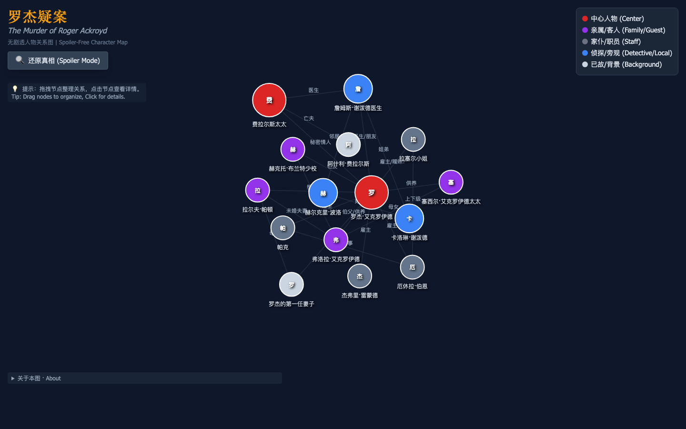
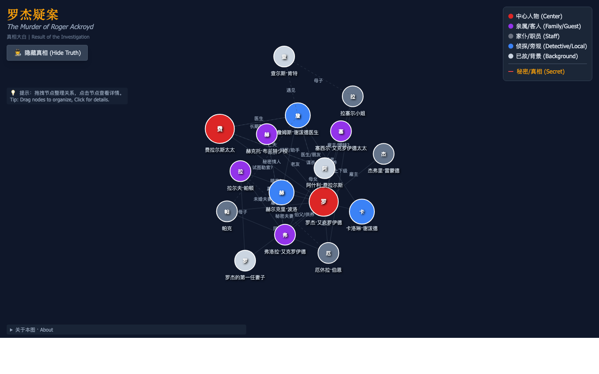

# 罗杰疑案人物关系图（无剧透）

阿加莎·克里斯蒂（Agatha Christie）经典侦探小说《罗杰疑案》（*The Murder of Roger Ackroyd*, 1926）的交互式人物关系图，专为**阅读伴读**设计：默认视图不含任何剧透，读完全书后可一键切换“真相模式”，查看隐藏人物与真实关系。

**在线访问：<https://roger-ackroyd-map.vercel.app/>**



## 功能

- **无剧透默认视图**：只呈现书中公开的人物身份与关系
- **真相模式**：一键还原隐藏人物、秘密关系与每个人的真实面目（红色虚线标注）
- **交互式力导向图**：拖拽节点整理布局，滚轮 / 双指缩放平移
- **人物详情**：点击节点查看中英双语人物介绍；真相模式下额外显示【真相】段落
- **关系标注**：每条连线都标有关系说明（医生、继父子、未婚夫妻……）

真相模式效果：



## 本地开发

```bash
npm install
npm run dev      # 开发服务器
npm run build    # 构建到 dist/
npm run preview  # 预览构建产物
```

技术栈：[Vite](https://vitejs.dev/) + [D3.js](https://d3js.org/)（力导向图）+ Tailwind CSS（CDN 工具类）。

## 相关项目

- [周四推理俱乐部第四部人物图谱（中英双语）](https://tmc.snownamida.top/) — 理查德·奥斯曼《The Last Devil to Die》

## 支持

如果这个小工具对你的阅读有帮助，欢迎 [☕ 请我喝咖啡](https://ko-fi.com/snownamida)。

## 许可证

[MIT](LICENSE) © Snownamida
